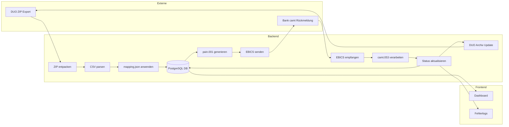
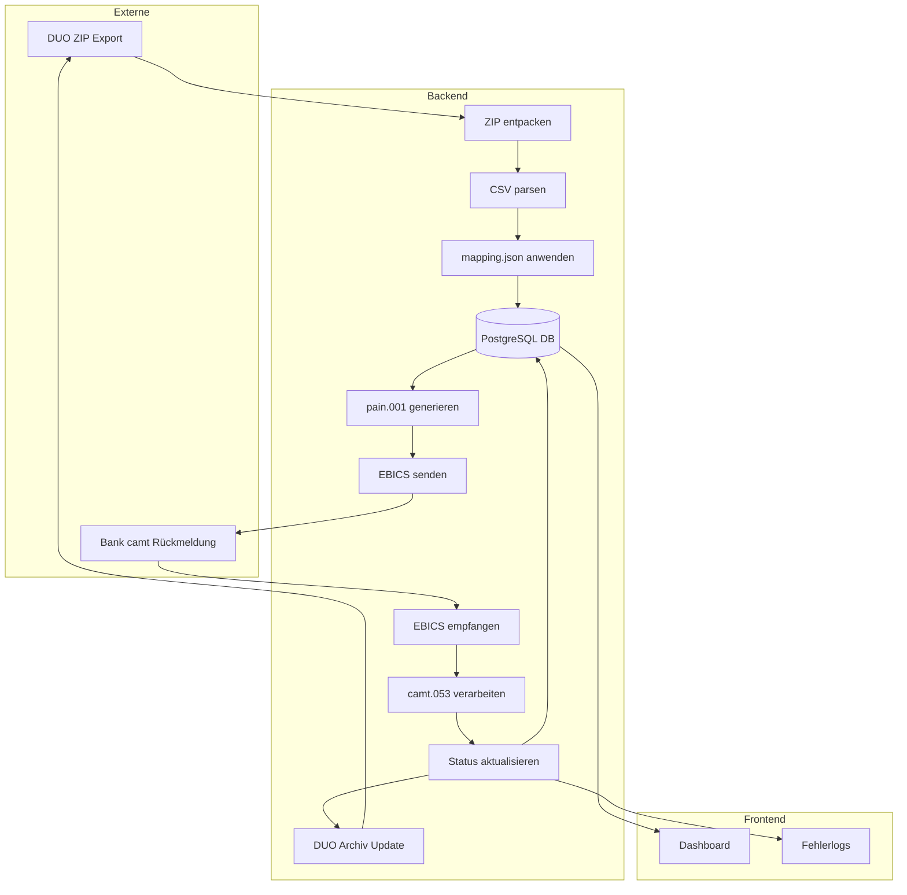

# System Hero Payments – EBICS ↔ DUO Integration

> Minimal-Setup für autonome Finanzdatenverarbeitung (ISO 20022, EBICS, DATEV DUO)

---

## 🔄 Zielsetzung

Eine modulare, sichere Node.js-Anwendung, die folgendes leistet:

1. **EBICS-Zahlungen senden und empfangen** (ISO 20022-konform, X.509-gesichert)
2. **DATEV Unternehmen online (DUO) Exporte autonom importieren** (z. B. Rechnungen, Zahlungsdaten)
3. **ISO 20022 pain/camt Dateien ↔ DUO CSV/XLSX abgleichen & konvertieren**

---

## 🌐 Architektur (Mermaid Diagramm)


> Dieser Graph zeigt, wie DUO-Exporte automatisch in dein Finanzsystem importiert werden können – z. B. für Lohnbuchhaltung, Kreditoren oder interne Zahlungsauslösung.

---

## ♻️ Verzeichnisstruktur (Minimal)

```bash
system-hero-payments/
├── core/
│   ├── ebics-client.ts       # Wrapper für node-ebics
│   ├── iso-parser.ts         # camt.053/054 + pain.001 Parser
│   └── duo-adapter.ts        # Zugriff auf DATEV DUO (WebDAV, REST, o.ä.)
├── crypto/
│   ├── cert-handler.ts       # Zertifikatsverwaltung
│   └── keygen.sh             # X.509 Key Generator Script
├── jobs/
│   ├── run-import.ts         # Loop für DUO-Import nach Zahlung
│   └── send-payment.ts       # Automatischer EBICS pain.001 Versand
├── data/
│   └── mappings.json         # DUO ↔ ISO20022 Tabellenmapping
├── ui/
│   └── status-api.ts         # Mini-API für Monitoring & Logs
├── tests/
│   ├── ebics.test.ts
│   └── duo-parser.test.ts
├── scripts/
│   └── deploy.sh
└── README.md
```

---

## 📊 DUO ↔ ISO20022 Mapping (Beispiel `mappings.json`)

```json
{
  "duo_feld": "Zahlungsempfänger",
  "iso20022_tag": "Cdtr\nNm"
},
{
  "duo_feld": "IBAN",
  "iso20022_tag": "CdtrAcct\nId\nIBAN"
},
{
  "duo_feld": "Betrag",
  "iso20022_tag": "InstdAmt"
}
```

---

## 🚀 Start in 3 Schritten

```bash
# 1. Zertifikate erzeugen
bash crypto/keygen.sh

# 2. Konfiguration anpassen
cp .env.example .env

# 3. Zahlung senden oder DUO-Daten importieren
npm run send-payment
npm run run-import
```

---

## 📊 Weiterentwicklungsideen

* ☑️ camt.054 automatische Verbuchung in DATEV
* ☑️ pain.008 (Lastschriften) unterstützen
* ☑️ Admin-UI zur Statuskontrolle
* ☑️ Integration in ERP-System

---

## Projekt umfang visualisiert:
```mermaid
graph TD

  subgraph Zielgruppe
    KMU[KMU]
    DEV[Entwickler]
    SHOPS[Shops / E-Com]
    SOLO[Selbstständige]
  end

  subgraph Datenquelle
    OCR[OCR Textract (optional)]
    MAN[Manuelle Eingabe]
  end

  subgraph App
    AGENTS[Agenten filtern + sortieren Rechnungen]
    TODO[Freigabe durch CEO/Prokurist]
    PAIN[pain.001 Generator]
    EBICSSend[EBICS Zahlung senden]
    Status[Zahlungsstatus speichern]
  end

  subgraph Infrastruktur
    AWS[AWS (Frankfurt)]
    LOG[Audit + GoBD Logs]
    DSGVO[DSGVO Schutzkonzept]
    ISO[ISO 27001 optional]
  end

  KMU --> OCR
  DEV --> MAN
  SHOPS --> OCR
  SOLO --> MAN

  OCR --> AGENTS
  MAN --> AGENTS
  AGENTS --> TODO
  TODO --> PAIN
  PAIN --> EBICSSend
  EBICSSend --> Status
  Status --> LOG
  Status --> AWS
  AWS --> DSGVO
  AWS --> ISO


```

Finanzplanung und ToDo's in den nächsten zwei Wochen

---

## 🔧 Ziel erreicht?

> Wenn System Hero Zahlungen senden, empfangen, auswerten und rechtssicher speichern kann – ohne manuelles Eingreifen.

---

## ✅ Nächste Schritte

1. Mapping-Tabelle vollständig machen (`mappings.json`)
2. EBICS Zugang testen (zertifikatsbasiert)
3. DUO Import-Logik implementieren (CSV/XLSX Parsing)
4. camt.053 Feedback-Schleife
5. MVP für Kunden GoBD-konform dokumentieren

---
