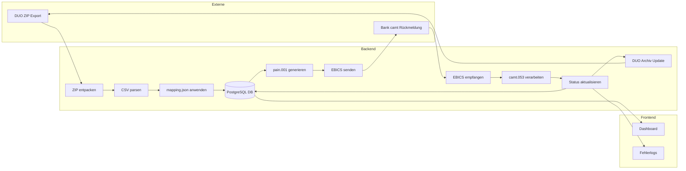
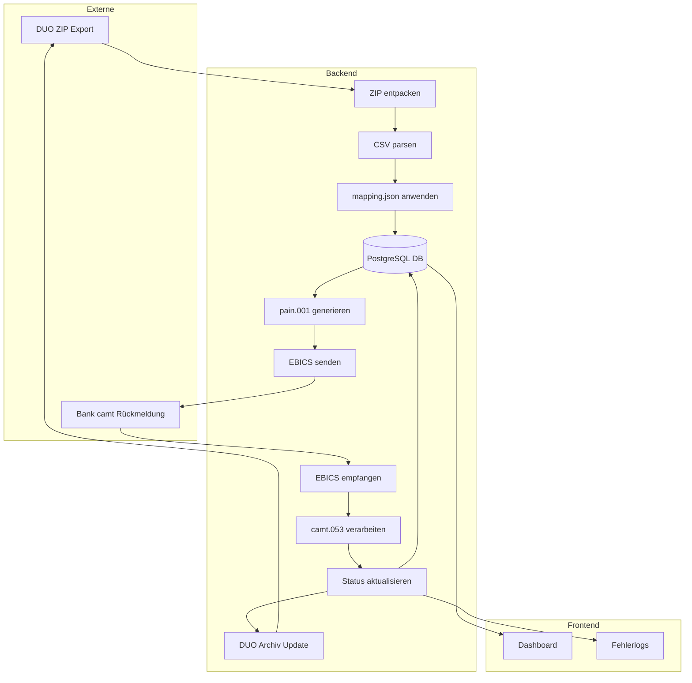
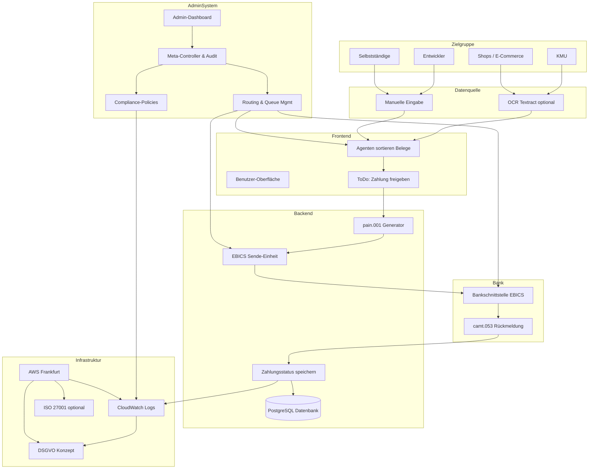
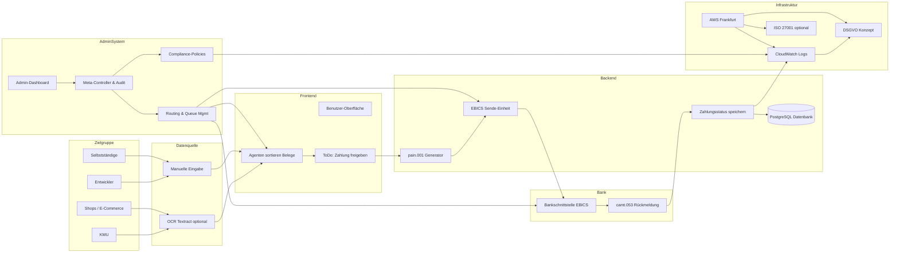
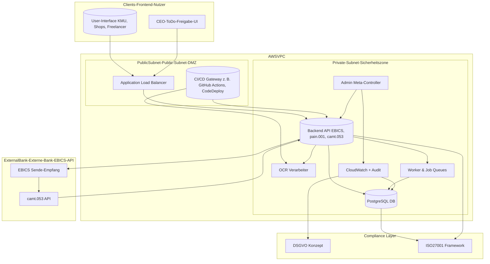

# System Hero Payments – EBICS ↔ DUO Integration

> Minimal-Setup für autonome Finanzdatenverarbeitung (ISO 20022, EBICS, DATEV DUO)

---

## 🔄 Zielsetzung

Eine modulare, sichere Node.js-Anwendung, die folgendes leistet:

1. **EBICS-Zahlungen senden und empfangen** (ISO 20022-konform, X.509-gesichert)
2. **DATEV Unternehmen online (DUO) Exporte autonom importieren** (z. B. Rechnungen, Zahlungsdaten)
3. **ISO 20022 pain/camt Dateien ↔ DUO CSV/XLSX abgleichen & konvertieren**

---

## 🌐 Architektur (Mermaid Diagramm)


> Dieser Graph zeigt, wie DUO-Exporte automatisch in dein Finanzsystem importiert werden können – z. B. für Lohnbuchhaltung, Kreditoren oder interne Zahlungsauslösung.

---

## ♻️ Verzeichnisstruktur (Minimal)

```bash
system-hero-payments/
├── core/
│   ├── ebics-client.ts       # Wrapper für node-ebics
│   ├── iso-parser.ts         # camt.053/054 + pain.001 Parser
│   └── duo-adapter.ts        # Zugriff auf DATEV DUO (WebDAV, REST, o.ä.)
├── crypto/
│   ├── cert-handler.ts       # Zertifikatsverwaltung
│   └── keygen.sh             # X.509 Key Generator Script
├── jobs/
│   ├── run-import.ts         # Loop für DUO-Import nach Zahlung
│   └── send-payment.ts       # Automatischer EBICS pain.001 Versand
├── data/
│   └── mappings.json         # DUO ↔ ISO20022 Tabellenmapping
├── ui/
│   └── status-api.ts         # Mini-API für Monitoring & Logs
├── tests/
│   ├── ebics.test.ts
│   └── duo-parser.test.ts
├── scripts/
│   └── deploy.sh
└── README.md
```

---

## 📊 DUO ↔ ISO20022 Mapping (Beispiel `mappings.json`)

```json
{
  "duo_feld": "Zahlungsempfänger",
  "iso20022_tag": "Cdtr\nNm"
},
{
  "duo_feld": "IBAN",
  "iso20022_tag": "CdtrAcct\nId\nIBAN"
},
{
  "duo_feld": "Betrag",
  "iso20022_tag": "InstdAmt"
}
```

---

## 🚀 Start in 3 Schritten

```bash
# 1. Zertifikate erzeugen
bash crypto/keygen.sh

# 2. Konfiguration anpassen
cp .env.example .env

# 3. Zahlung senden oder DUO-Daten importieren
npm run send-payment
npm run run-import
```

---

## 📊 Weiterentwicklungsideen

* ☑️ camt.054 automatische Verbuchung in DATEV
* ☑️ pain.008 (Lastschriften) unterstützen
* ☑️ Admin-UI zur Statuskontrolle
* ☑️ Integration in ERP-System

---

## Projekt umfang visualisiert:


Finanzplanung und ToDo's in den nächsten zwei Wochen
Graph LR Darstellung: 

---

## V03 zur visualisierung 

---

### 🔍 Erläuterung (Lesefluss von oben nach unten):

- **Zielgruppen** starten Prozesse → geben Rechnungen rein (OCR / Manuell)
- **Frontend** sortiert & bietet **ToDo-Freigabe**
- **Backend** generiert & versendet `pain.001` via **EBICS**
- **Bankschnittstelle** meldet per `camt.053` zurück
- **Admin-System** ist die neutrale **Monopoly-Bank**, verbindet alles, beobachtet alles, steuert alle Schnittstellen & sorgt für DSGVO/ISO/GoBD-Konformität

---

### 🎯 Zielbezug

> Keine Zahlung ohne menschliche Freigabe. Das System ist vollständig modular, auditierbar und auf ISO 27001 skalierbar.

---

### ✅ Next Steps

1. **[ ]** Mermaid-Block in `README.md` einfügen und mit GitHub Markdown Renderer prüfen  
2. **[ ]** `Admin-System` später in echte RBAC-Logik (Role-Based Access Control) übersetzen  
3. **[ ]** API-Diagramm für `/authorize`, `/validate`, `/send`, `/status` erstellen  
4. **[ ]** Weitere pain/camt Typen auflisten → `pain.008`, `camt.054`, etc. (wenn gewünscht, liefere ich)

---

🤖 Willst du als Nächstes:

1. `API-Routing-Diagramm` (technische Sicht)?
2. `pain.*` / `camt.*` Typen + deren Zweck?
3. Canvas/Whiteboard-Vorlage zum Weiterplanen?

Wähl 1–3 oder sag was du brauchst.


---

## Projekt Umfang bis zum Status Marktreif

| Modul                                                | ⬇️ Geschätzte Codezeilen |
| ---------------------------------------------------- | ------------------------ |
| EBICS-Client (z. B. `node-ebics` Wrapper)            | 600                      |
| ISO20022 Generator & Parser (`pain.001`, `camt.053`) | 800                      |
| Zertifikatsmanagement + Keyhandling                  | 300                      |
| DUO / Lexware Import (ZIP, CSV/XLSX, Validierung)    | 400                      |
| mappings.json & DataMapper                           | 150                      |
| PostgreSQL Datenbank-Anbindung                       | 200                      |
| Webhook-Trigger + Cronjobs                           | 150                      |
| ToDo-Portal mit Freigabe-Logik (z. B. CEO UI)        | 400                      |
| Frontend-Dashboard (React, Tailwind, Auth)           | 800                      |
| OCR-Integration Textract UI                          | 300                      |
| CloudWatch Logging, Secrets Manager, DSGVO/AWS-Infra | 300                      |
| Testcases, Validatoren, Helper                       | 300                      |
| DevOps Scripts, Deploy Pipelines                     | 200                      |

## Roadmap Quellcode: 

```mermaid
flowchart TD
    %% ➊ Governance & Security Foundation
    step1["1  Establish ISMS scope & policies<br/>
            <b>Tech:</b> Confluence + Jira, ISO 27001 toolkit, GitHub Docs"]
    step2["2  Model roles & access control (Model A)<br/>
            <b>Tech:</b> Keycloak (OIDC), AWS IAM + SCP, RBAC"]    
    %% ➋ Cloud & DevOps
    step3["3  Provision AWS core (VPC, Subnets, SG)<br/>
            <b>Tech:</b> Terraform, AWS CDK, AWS Config"]
    step4["4  Deploy container platform & DB<br/>
            <b>Tech:</b> EKS, Helm, Docker, PostgreSQL RDS"]
    step5["5  Enable central logging/monitoring<br/>
            <b>Tech:</b> CloudWatch, Prometheus, Grafana, GuardDuty"]
    %% ➌ Backend Payments
    step6["6  Implement pain.001 generator<br/>
            <b>Tech:</b> Python (iso20022-lib), FastAPI"]
    step7["7  Build EBICS sender service<br/>
            <b>Tech:</b> Python ebics-client, Celery, SQS"]
    step8["8  Parse camt.053 & update status<br/>
            <b>Tech:</b> Python xmltodict, SQLAlchemy"]
    %% ➍ Frontend & Workflow
    step9["9  Create React dashboard<br/>
            <b>Tech:</b> Next.js, Tailwind, React Query"]
    step10["10  Integrate OCR & agent sorting<br/>
             <b>Tech:</b> AWS Textract, LangChain, S3"]
    step11["11  Build payment-approval UI<br/>
             <b>Tech:</b> State Machines (XState), GraphQL API"]
    %% ➎ Admin Meta-System
    step12["12  Add admin dashboard & audits<br/>
             <b>Tech:</b> React, Keycloak-admin, CloudTrail"]
    step13["13  Implement compliance rule engine<br/>
             <b>Tech:</b> Open Policy Agent, Python"]
    %% ➏ Integration & Messaging
    step14["14  Wire services via event bus<br/>
             <b>Tech:</b> AWS SNS/SQS, EventBridge"]
    step15["15  Expose secure public API<br/>
             <b>Tech:</b> API Gateway, Lambda authorizer, WAF"]
    %% ➐ Continuous Compliance
    step16["16  Automate security scans & IaC drift<br/>
             <b>Tech:</b> AWS Inspector, Snyk, tfsec"]
    step17["17  Run pen-tests & finalize ISO 27001 audit<br/>
             <b>Tech:</b> OWASP ZAP, Nessus, External Auditor"]
    %% ➑ Launch & Operations
    step18["18  Go-live & ongoing ISO internal audits<br/>
             <b>Tech:</b> CloudWatch Alarms, PagerDuty, SOC process"]

    %% --- Flow order
    step1 --> step2 --> step3 --> step4 --> step5 --> step6 --> step7 --> step8
    step8 --> step14
    step5 --> step9
    step9 --> step10 --> step11 --> step14
    step14 --> step12 --> step13 --> step15 --> step16 --> step17 --> step18
```


## 🔧 Ziel erreicht?

> Wenn System Hero Zahlungen senden, empfangen, auswerten und rechtssicher speichern kann – ohne manuelles Eingreifen.

---

## ✅ Nächste Schritte

1. Mapping-Tabelle vollständig machen (`mappings.json`)
2. EBICS Zugang testen (zertifikatsbasiert)
3. DUO Import-Logik implementieren (CSV/XLSX Parsing)
4. camt.053 Feedback-Schleife
5. MVP für Kunden GoBD-konform dokumentieren

---
