# System Hero Payments – EBICS ↔ DUO Integration

> Minimal-Setup für autonome Finanzdatenverarbeitung (ISO 20022, EBICS, DATEV DUO)

---

## 🔄 Zielsetzung

Eine modulare, sichere Node.js-Anwendung, die folgendes leistet:

1. **EBICS-Zahlungen senden und empfangen** (ISO 20022-konform, X.509-gesichert)
2. **DATEV Unternehmen online (DUO) Exporte autonom importieren** (z. B. Rechnungen, Zahlungsdaten)
3. **ISO 20022 pain/camt Dateien ↔ DUO CSV/XLSX abgleichen & konvertieren**

---

## 🌐 Architektur (Mermaid Diagramm)

```mermaid
graph TD

  subgraph Externe
    DUO[DUO ZIP Export]
    Bank[Bank camt Rückmeldung]
  end

  subgraph Backend
    Unzip[ZIP entpacken]
    Parse[CSV parsen]
    Map[mapping.json anwenden]
    DB[(PostgreSQL DB)]
    Gen[pain.001 generieren]
    Send[EBICS senden]
    Recv[EBICS empfangen]
    Camt[camt.053 verarbeiten]
    Update[Status aktualisieren]
    Archiv[DUO Archiv Update]
  end

  subgraph Frontend
    UI[Dashboard]
    Logs[Fehlerlogs]
  end

  DUO --> Unzip --> Parse --> Map --> DB
  DB --> Gen --> Send --> Bank --> Recv --> Camt --> Update --> DB
  Update --> Archiv --> DUO
  DB --> UI
  Update --> Logs
```


> Dieser Graph zeigt, wie DUO-Exporte automatisch in dein Finanzsystem importiert werden können – z. B. für Lohnbuchhaltung, Kreditoren oder interne Zahlungsauslösung.

---

## ♻️ Verzeichnisstruktur (Minimal)

```bash
system-hero-payments/
├── core/
│   ├── ebics-client.ts       # Wrapper für node-ebics
│   ├── iso-parser.ts         # camt.053/054 + pain.001 Parser
│   └── duo-adapter.ts        # Zugriff auf DATEV DUO (WebDAV, REST, o.ä.)
├── crypto/
│   ├── cert-handler.ts       # Zertifikatsverwaltung
│   └── keygen.sh             # X.509 Key Generator Script
├── jobs/
│   ├── run-import.ts         # Loop für DUO-Import nach Zahlung
│   └── send-payment.ts       # Automatischer EBICS pain.001 Versand
├── data/
│   └── mappings.json         # DUO ↔ ISO20022 Tabellenmapping
├── ui/
│   └── status-api.ts         # Mini-API für Monitoring & Logs
├── tests/
│   ├── ebics.test.ts
│   └── duo-parser.test.ts
├── scripts/
│   └── deploy.sh
└── README.md
```

---

## 📊 DUO ↔ ISO20022 Mapping (Beispiel `mappings.json`)

```json
{
  "duo_feld": "Zahlungsempfänger",
  "iso20022_tag": "Cdtr\nNm"
},
{
  "duo_feld": "IBAN",
  "iso20022_tag": "CdtrAcct\nId\nIBAN"
},
{
  "duo_feld": "Betrag",
  "iso20022_tag": "InstdAmt"
}
```

---

## 🚀 Start in 3 Schritten

```bash
# 1. Zertifikate erzeugen
bash crypto/keygen.sh

# 2. Konfiguration anpassen
cp .env.example .env

# 3. Zahlung senden oder DUO-Daten importieren
npm run send-payment
npm run run-import
```

---

## 📊 Weiterentwicklungsideen

* ☑️ camt.054 automatische Verbuchung in DATEV
* ☑️ pain.008 (Lastschriften) unterstützen
* ☑️ Admin-UI zur Statuskontrolle
* ☑️ Integration in ERP-System

---

## Projekt umfang visualisiert:

```mermaid
graph TD
  subgraph Zielgruppe
    KMU[KMU]
    DEV[Entwickler]
    SHOPS[Shops / E-Commerce]
    SOLO[Selbstständige]
  end

  subgraph Datenquelle
    OCR[OCR Textract optional]
    MAN[Manuelle Eingabe]
  end

  subgraph Frontend
    UI[Benutzer-Oberfläche]
    AGENTS[Agenten sortieren Belege]
    TODO[ToDo: Zahlung freigeben]
  end

  subgraph Backend
    PAIN[pain.001 Generator]
    EBICS[EBICS Sende-Einheit]
    STATUS[Zahlungsstatus speichern]
    DB[(PostgreSQL Datenbank)]
  end

  subgraph AdminSystem
    ADMIN_UI[Admin-Dashboard]
    ADMIN_BACK[Meta-Controller & Audit]
    POLICIES[Compliance-Policies]
    ROUTING[Routing & Queue Mgmt]
  end

  subgraph Bank
    BANK_API[Bankschnittstelle EBICS]
    CAMT[camt.053 Rückmeldung]
  end

  subgraph Infrastruktur
    AWS[AWS Frankfurt]
    LOGS[CloudWatch Logs]
    DSGVO[DSGVO Konzept]
    ISO[ISO 27001 optional]
  end

  KMU --> OCR
  DEV --> MAN
  SHOPS --> OCR
  SOLO --> MAN
  OCR --> AGENTS
  MAN --> AGENTS
  AGENTS --> TODO
  TODO --> PAIN
  PAIN --> EBICS
  EBICS --> BANK_API
  BANK_API --> CAMT
  CAMT --> STATUS
  STATUS --> DB

  ADMIN_UI --> ADMIN_BACK
  ADMIN_BACK --> ROUTING
  ROUTING --> EBICS
  ROUTING --> AGENTS
  ROUTING --> BANK_API
  ADMIN_BACK --> POLICIES
  POLICIES --> LOGS
  STATUS --> LOGS
  AWS --> LOGS
  LOGS --> DSGVO
  AWS --> DSGVO
  AWS --> ISO


```


Finanzplanung und ToDo's in den nächsten zwei Wochen
Graph LR Darstellung: 

---

## V03 zur visualisierung 
```mermaid
graph TD

  %% Netzarchitektur
  subgraph AWSVPC
    subgraph PublicSubnet-Public-Subnet-DMZ
      ALB[Application Load Balancer]
      CI_CD[(CI/CD Gateway z. B. GitHub Actions, CodeDeploy)]
    end

    subgraph Private-Subnet-Sicherheitszone
      API[(Backend API EBICS, pain.001, camt.053)]
      WORKER[Worker & Job Queues]
      OCR_SERVICE[OCR Verarbeiter]
      ADMIN_CTRL[Admin Meta-Controller]
      DB[(PostgreSQL DB)]
      LOG[CloudWatch + Audit]
    end

    ALB --> API
    CI_CD --> API
    CI_CD --> OCR_SERVICE
    API --> DB
    API --> WORKER
    WORKER --> DB
    API --> OCR_SERVICE
    ADMIN_CTRL --> API
    ADMIN_CTRL --> LOG
    LOG --> DB
  end

  %% Externe Systeme
  subgraph Clients-Frontend-Nutzer]
    CEO[CEO ToDo-Freigabe UI]
    USER[(User-Interface KMU, Shops, Freelancer)]
  end

  subgraph ExternalBank-Externe-Bank-EBICS-API
    EBICS_API[EBICS Sende-Empfang]
    CAMT_API[camt.053 API]
  end

  USER --> ALB
  CEO --> ALB
  API --> EBICS_API
  EBICS_API --> CAMT_API
  CAMT_API --> API

  %% DSGVO/ISO Layer
  subgraph Compliance[Compliance Layer]
    DSGVO[DSGVO Konzept]
    ISO[ISO27001 Framework]
  end

  LOG --> DSGVO
  DB --> ISO
  API --> ISO
```
---

### 🔍 Erläuterung (Lesefluss von oben nach unten):

- **Zielgruppen** starten Prozesse → geben Rechnungen rein (OCR / Manuell)
- **Frontend** sortiert & bietet **ToDo-Freigabe**
- **Backend** generiert & versendet `pain.001` via **EBICS**
- **Bankschnittstelle** meldet per `camt.053` zurück
- **Admin-System** ist die neutrale **Monopoly-Bank**, verbindet alles, beobachtet alles, steuert alle Schnittstellen & sorgt für DSGVO/ISO/GoBD-Konformität

---

### 🎯 Zielbezug

> Keine Zahlung ohne menschliche Freigabe. Das System ist vollständig modular, auditierbar und auf ISO 27001 skalierbar.

---

### ✅ Next Steps

1. **[ ]** Mermaid-Block in `README.md` einfügen und mit GitHub Markdown Renderer prüfen  
2. **[ ]** `Admin-System` später in echte RBAC-Logik (Role-Based Access Control) übersetzen  
3. **[ ]** API-Diagramm für `/authorize`, `/validate`, `/send`, `/status` erstellen  
4. **[ ]** Weitere pain/camt Typen auflisten → `pain.008`, `camt.054`, etc. (wenn gewünscht, liefere ich)

---

🤖 Willst du als Nächstes:

1. `API-Routing-Diagramm` (technische Sicht)?
2. `pain.*` / `camt.*` Typen + deren Zweck?
3. Canvas/Whiteboard-Vorlage zum Weiterplanen?

Wähl 1–3 oder sag was du brauchst.


---

## Projekt Umfang bis zum Status Marktreif

| Modul                                                | ⬇️ Geschätzte Codezeilen |
| ---------------------------------------------------- | ------------------------ |
| EBICS-Client (z. B. `node-ebics` Wrapper)            | 600                      |
| ISO20022 Generator & Parser (`pain.001`, `camt.053`) | 800                      |
| Zertifikatsmanagement + Keyhandling                  | 300                      |
| DUO / Lexware Import (ZIP, CSV/XLSX, Validierung)    | 400                      |
| mappings.json & DataMapper                           | 150                      |
| PostgreSQL Datenbank-Anbindung                       | 200                      |
| Webhook-Trigger + Cronjobs                           | 150                      |
| ToDo-Portal mit Freigabe-Logik (z. B. CEO UI)        | 400                      |
| Frontend-Dashboard (React, Tailwind, Auth)           | 800                      |
| OCR-Integration Textract UI                          | 300                      |
| CloudWatch Logging, Secrets Manager, DSGVO/AWS-Infra | 300                      |
| Testcases, Validatoren, Helper                       | 300                      |
| DevOps Scripts, Deploy Pipelines                     | 200                      |


## 🔧 Ziel erreicht?

> Wenn System Hero Zahlungen senden, empfangen, auswerten und rechtssicher speichern kann – ohne manuelles Eingreifen.

---

## ✅ Nächste Schritte

1. Mapping-Tabelle vollständig machen (`mappings.json`)
2. EBICS Zugang testen (zertifikatsbasiert)
3. DUO Import-Logik implementieren (CSV/XLSX Parsing)
4. camt.053 Feedback-Schleife
5. MVP für Kunden GoBD-konform dokumentieren

---
